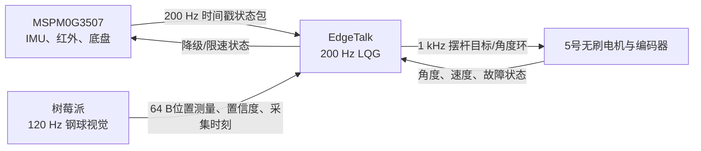

# 2026 TI 电赛备赛：H题车载平衡滚球

本仓库用于 H 题“车载平衡滚球运动控制系统”的独立方案、算法仿真和后续固件实现。当前工作分支为 `prep/2026`；在实物参数和引脚确认前，控制代码只保留在可离线验证的 `experiments/`，不会自动使能电机或底盘。

## 当前结论

主方案采用三块板，但不是为了把现有板卡全部用上：

| 板卡 | 正式职责 | 建议频率 |
|---|---|---:|
| 天猛星 MSPM0G3507 | 红外循迹、底盘速度/差速环、IMU UART DMA采集、底盘状态发布 | 1 kHz / 500 Hz / 200 Hz |
| 树莓派 | 灰度ROI、轮廓筛选、钢球定位、比赛视频显示与存储 | 120 Hz |
| Infineon EdgeTalk | 全部滚球控制算法、球状态观测、摆杆角度内环、无刷驱动接口 | 200 Hz / 1 kHz / 20 kHz FOC |

F407 和 NanoPi M5 暂不进入正式链路，分别保留作 MCU 与视觉计算备选。滚球主算法为“非线性可测扰动前馈 + 延迟鲁棒 LQG”，当前增益为 `K=[14.56338, 3.31547, 0.58093]`。



## 已验证的软件结果

- 29 项模型、观测器、控制器和压力战役测试通过。
- 静止 `0 -> +5 cm -> -5 cm` 均在 5 s 内进入并保持 `+-1 cm` 误差带。
- 72 组分级压力测试中，2级干扰 `12/12` 通过，最坏峰值误差 `6.48 mm`；3级首次失效。
- 这些结果仅证明数值可行性，不代替摄像头、机构、电机和实车标定。

## 仓库导航

- `docs/architecture/system-overview.md`：三板结构、闭环量、频率和降级策略。
- `docs/hardware/measured-parameters.md`：钢球等实物参数、计算值和待测不确定度。
- `docs/decisions/ADR-001-h-ball-control-architecture.md`：方案和备选算法决策。
- `docs/reference/infineon-edgetalk-motor5.md`：从参考仓库提取的 EdgeTalk、5号电机、编译与烧录经验。
- `experiments/h_ball_control_sim/`：LQG模型、多速率仿真、72组压力测试和输出图表。
- `firmware/edgetalk/`、`firmware/mspm0/`、`vision/raspberrypi/`：待引脚和硬件版本确认后落地的子系统边界。
- `shared/protocol/`：跨板时间戳、状态量和故障语义草案。

## 运行仿真

```powershell
python -m pip install -r experiments\h_ball_control_sim\requirements.txt
python -m pytest -q experiments\h_ball_control_sim\tests
python experiments\h_ball_control_sim\run_lqr_study.py
python experiments\h_ball_control_sim\run_stress_campaign.py
```

以上命令均为纯数值计算，不连接、解锁或驱动任何硬件。

## 参考关系

[`HalloYang06/PSOC_E84_robot`](https://github.com/HalloYang06/PSOC_E84_robot) 是参考仓库，不是本仓库的前身。本仓库仅参考其中 EdgeTalk M33 工具链、Classic CAN bring-up、RS00 5号电机和验证烧录流程，不迁入医疗机械臂业务、关节参数、安全策略或第三方固件树。
