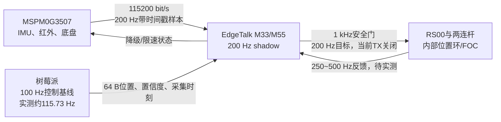

# 2026 TI 电赛备赛：H题车载平衡滚球

本仓库用于 H 题“车载平衡滚球运动控制系统”的独立方案、算法仿真和固件实现。当前工作分支为
`prep/2026`；EdgeTalk、MSPM0与树莓派已完成只读通信和shadow链路，但所有自动任务仍保持
`ACTUATOR_TX=0`，不会使能RS00或发起底盘运动。

## 当前结论

主方案采用三块板，但不是为了把现有板卡全部用上：

| 板卡 | 正式职责 | 建议频率 |
|---|---|---:|
| 天猛星 MSPM0G3507 | 红外循迹、底盘速度/差速环、IMU采集和带时间信息的底盘状态发布；不运行滚球算法 | WIT UART已设115200；模型按200 Hz唯一样本，实机频率以源时间戳确认 |
| 树莓派 | 钢球视觉定位、置信度、帧号和采集/处理时延 | 控制基线100 Hz；实机按采集时间去重约115.73 Hz |
| Infineon EdgeTalk | M33通信/1 kHz安全门，M55 200 Hz滚球shadow；两连杆逆解和RS00执行仍待接入 | 200 Hz估计控制 / 200 Hz目标（当前TX关闭） |

F407 和 NanoPi M5 暂不进入正式链路，分别保留作 MCU 与视觉计算备选。当前可部署目标算法为
“历史回溯卡尔曼 + LQI + IMU前馈 + 端部保护”；现有M55只运行旧LQG的`SHADOW_ONLY`回归。
仓库原Python仿真的
`K=[14.56338, 3.31547, 0.58093]`是较早的60 Hz/通用执行器回归基线，不是当前
RS00两连杆系统的部署增益。最新事实、未决项和部署顺序见
[`docs/ai-handoffs/h-ball-control.md`](docs/ai-handoffs/h-ball-control.md)。



## 已验证的软件结果

- 29 项模型、观测器、控制器和压力战役测试通过。
- 静止 `0 -> +5 cm -> -5 cm` 均在 5 s 内进入并保持 `+-1 cm` 误差带。
- 72 组分级压力测试中，2级干扰 `12/12` 通过，最坏峰值误差 `6.48 mm`；3级首次失效。
- 上述三项来自较早Python基线。当前RS00两连杆Simulink已按新实测机构和115200/200 Hz
  IMU基线重跑：正常车辆工况在100 Hz视觉下RMS误差`2.344 mm`、峰值`5.216 mm`，
  严格1 cm通过；启停/制动/坑洼组合的峰值达`60.559 mm`，说明当前物理与控制包线
  尚不能覆盖该扰动。
- 可行组合恢复工况中，前馈+扰动估计RMS为`10.62 mm`，仅KF-LQI为`13.46 mm`；
  200 Hz是当前仿真基线，实机唯一样本率仍须按MSPM0源时间戳验证。
- 所有结果只证明数值可行性，不代替摄像头、机构、电机和实车标定，也不等于实机已满足1 cm。

## 仓库导航

- `docs/ai-handoffs/h-ball-control.md`：后续AI首先阅读的当前部署交接。
- `docs/architecture/system-overview.md`：三板结构、闭环量、频率和降级策略。
- `docs/hardware/measured-parameters.md`：钢球等实物参数、计算值和待测不确定度。
- `docs/decisions/ADR-001-h-ball-control-architecture.md`：方案和备选算法决策。
- `docs/decisions/ADR-004-edgetalk-runtime-and-stream-boundaries.md`：当前树莓派/USB/CAN、双核运行时、CSP电机模式和安全边界。
- `docs/decisions/ADR-006-rs00-two-link-deployment-baseline.md`：100 Hz视觉、RS00与两连杆部署基线。
- `docs/reference/infineon-edgetalk-motor5.md`：从参考仓库提取的 EdgeTalk、5号电机、编译与烧录经验。
- `experiments/h_ball_control_sim/`：LQG模型、多速率仿真、72组压力测试和输出图表。
- `experiments/h_ball_control_simulink/`：RS00、两连杆、滚滑摩擦、100 Hz视觉和整车扰动Simulink基线。
- `firmware/edgetalk/`、`firmware/mspm0/`、`vision/raspberrypi/`：待引脚和硬件版本确认后落地的子系统边界。
- `shared/protocol/`：跨板时间戳、状态量和故障语义草案。

## 运行仿真

```powershell
python -m pip install -r experiments\h_ball_control_sim\requirements.txt
python -m pytest -q experiments\h_ball_control_sim\tests
python experiments\h_ball_control_sim\run_lqr_study.py
python experiments\h_ball_control_sim\run_stress_campaign.py
```

以上命令均为纯数值计算，不连接、解锁或驱动任何硬件。

MATLAB/Simulink模型在MATLAB R2025b中已验证，可在
`experiments\h_ball_control_simulink`目录运行：

```matlab
run_camera_rate_comparison
run_vehicle_stress_test
analyze_two_link_mechanism
run_ball_pipe_demo
run_ball_pipe_sweep
```

## 参考关系

[`HalloYang06/PSOC_E84_robot`](https://github.com/HalloYang06/PSOC_E84_robot) 是参考仓库，不是本仓库的前身。本仓库仅参考其中 EdgeTalk M33 工具链、Classic CAN bring-up、RS00 5号电机和验证烧录流程，不迁入医疗机械臂业务、关节参数、安全策略或第三方固件树。
