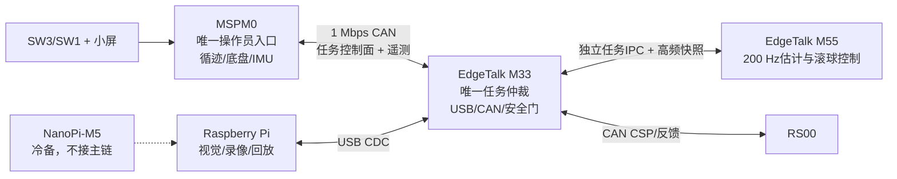
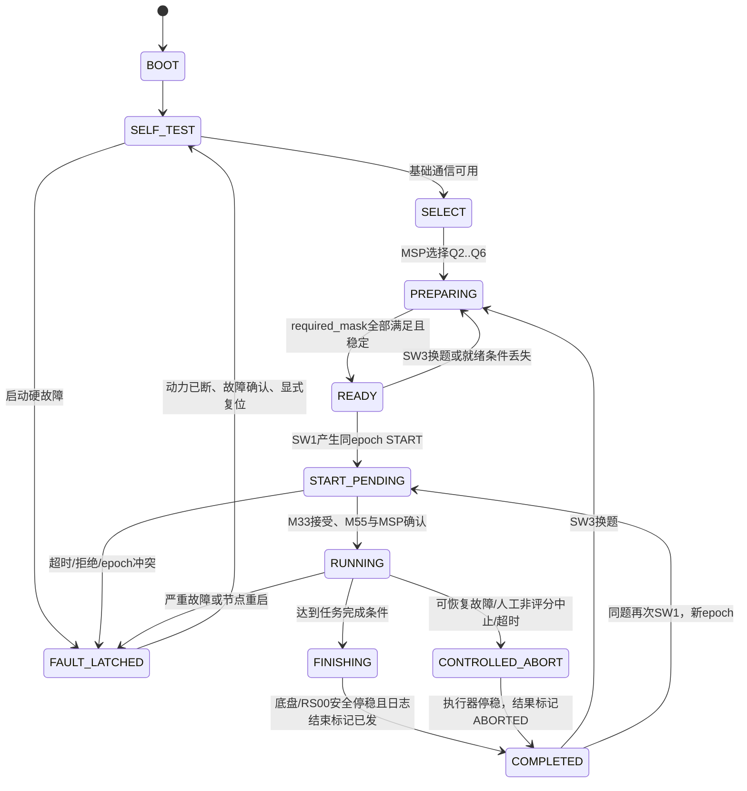

# H题电赛现场演示任务状态机与实施计划

Date: 2026-07-31

Status: planning baseline; no automatic actuator authorization

## 1. 目标与边界

这套状态机解决四件事：车上只有两个按钮时如何选题和开始、多个处理器如何确认同一个
任务、如何按赛题时刻计时并归档视频、任一链路异常时如何确定地停车和复位。

关键链路固定为：



本规划不改变控制所有权：MSP本地闭合底盘，M55计算滚球目标，M33独占RS00最终安全门。
自动化测试只验证协议和状态，不允许使能电机或自主运动。

## 2. 赛题映射

跨板协议直接使用官方题号，避免现有底盘代码内部`CAR_TASK_1..3`与赛题题号冲突。

| ID | SW3页面 | 赛题动作 | 官方时间 | 关键完成条件 |
|---:|---|---|---:|---|
| Q1 | 不可选，后台常驻 | 实时显示并完整保存/回放钢球视频 | 全程 | 树莓派服务READY，按epoch生成视频与日志 |
| Q2 | `Q2 FAST LAP` | A出发，顺时针一圈回A | ≤20 s | 重新识别A、车停稳、停车位置偏差≤2 cm |
| Q3 | `Q3 BALL +/-5` | 静止车上，O→+5 cm→-5 cm并稳定 | ≤5 s | 两目标依次稳定，车轮始终禁止运动 |
| Q4 | `Q4 A TO B` | A出发通过B，球保持中心 | AB≤8 s | 到达B并停车；运行评分段球误差≤1 cm |
| Q5 | `Q5 CENTER LAP` | A出发一圈通过A，球保持中心 | ≤30 s | A重捕获并停车；运行评分段球误差≤1 cm |
| Q6 | `Q6 HOLD X LAP` | 任意初始球位置，一圈通过A | ≤30 s | 锁存初始目标后整圈保持；误差≤1 cm |

Q2虽然没有单列滚球误差分值，也仍启用正常滚球保护，防止钢球碰端或掉落。Q3的
`CHASSIS_READY`表示底盘健康，但执行过程中M33要求`CHASSIS_INHIBITED=1`。

## 3. 全局状态机

全局状态由M33产生，MSP、M55和树莓派只镜像。任何旧epoch或任务ID不匹配的消息只记
诊断，不改变当前状态。



### 3.1 状态转移规则

| 当前状态 | 触发 | 下一状态 | 必须动作 |
|---|---|---|---|
| BOOT | M33任务模块启动 | SELF_TEST | 执行器禁止；清除未完成上下文，不复用上次RUNNING |
| SELF_TEST | 基础节点在线 | SELECT | 发布空闲状态；录像服务开始预览 |
| SELECT/PREPARING | SW3选择 | PREPARING | 广播拟执行Q号和next epoch；所有节点装载任务配置 |
| PREPARING | READY连续稳定500 ms | READY | 小屏绿色READY；禁止自动起步 |
| READY | 任一必需位丢失 | PREPARING | 清除READY；已经按下但未接受的启动不得排队 |
| READY | SW1短按 | START_PENDING | MSP立即本地起算；20 Hz重发START和按键时刻 |
| START_PENDING | M33接受且MSP/M55上下文一致 | RUNNING | USB START marker；开放相应的本地任务状态机 |
| START_PENDING | 300 ms未形成一致上下文 | FAULT_LATCHED | 不动，显示启动握手失败 |
| RUNNING | 任务完成谓词成立 | FINISHING | 先停止运动需求，再固化结果 |
| FINISHING | 停稳且END marker已提交 | COMPLETED | 冻结用时和结果；允许回放 |
| RUNNING | 可控退化或任务deadline | CONTROLLED_ABORT | 底盘受控停车、RS00安全保持/停止；本次无效 |
| 任意活动态 | 急停、RS00严重故障、仲裁器/节点重启 | FAULT_LATCHED | 立即撤销运动权限；需人工确认和重新SELF_TEST |

“END marker已提交”不允许阻挡紧急停机；它只决定何时从FINISHING转到COMPLETED。

## 4. 各节点局部状态

### 4.1 MSPM0

```text
BOOT -> LOCAL_SELF_TEST -> WAIT_M33 -> SELECT/PREPARE -> READY
READY --SW1--> START_SENT -> LOCAL_RUNNING -> LOCAL_STOPPED -> RESULT
任意活动态 -> LOCAL_ABORT/LOCAL_FAULT
```

- 按键、车载计时显示、循迹地标和底盘速度环只在MSP处理。
- `START_SENT`保持20 Hz重复START，直到收到相同epoch的M33 RUNNING。
- Q2/Q4/Q5/Q6由MSP报告离开A、B/A重捕获、线丢失、制动和停稳；Q3保持轮驱动禁止。
- M33失联超过100 ms或收到ABORT/FAULT时，MSP本地进入受控停车，不能等待网络恢复。

### 4.2 EdgeTalk M33

```text
BOOT/SELF_TEST -> COLLECT_READY -> ARBITRATE_START -> SUPERVISE_RUNNING
-> COORDINATE_FINISH -> PUBLISH_RESULT
故障 -> REVOKE_ACTUATORS -> FAULT_LATCHED
```

M33持有唯一`{mission_epoch, mission_id, global_state, target, start_times, result}`。它检查
数据freshness、M55结果、RS00状态、底盘状态和配置哈希，只有这些字段完全一致才允许
正式执行器路径继续。

### 4.3 EdgeTalk M55

```text
WAIT_CONTEXT -> LOAD_PROFILE -> CONTROLLER_READY -> ACTIVE_PHASES
-> GOAL_SETTLED -> HOLD_SAFE
输入或上下文失效 -> DEGRADE/REQUEST_ABORT
```

M55不读按键、不访问CAN、不自行增加epoch。Q3目标序列和Q2/Q4/Q5的中心目标、Q6锁存
目标都来自M33任务上下文；控制输出必须回带同一epoch和phase。

### 4.4 Raspberry Pi

```text
SERVICE_BOOT -> CAMERA_PREVIEW -> PREBUFFERING -> RECORD_READY
START_MARKER -> RECORDING(epoch) -> END_MARKER -> FINALIZE -> PLAYBACK_READY
USB/磁盘/相机异常 -> SERVICE_FAULT
```

- 始终保留至少2 s编码前滚缓冲，防止USB marker传播造成视频缺头。
- 文件名使用`YYYYMMDD-HHMMSS_Q<id>_E<epoch>`，同名目录保存原视频、标注视频、视觉
  测量、控制日志和result.json；不进Git。
- PREPARE阶段先检查相机、磁盘空间和文件可写，只有`RECORD_READY`才贡献READY位。
- Q1的现场回放从已经finalize的文件读取，不复用控制线程做阻塞解码。

## 5. 两个按钮的确定语义

按钮均为低电平按下，软件采用20 ms消抖、释放后产生一次事件。

| 状态 | SW3短按 | SW1短按 | SW1长按候选 |
|---|---|---|---|
| SELECT/PREPARING | 循环Q2→Q3→Q4→Q5→Q6 | 若未READY则只显示首个缺失条件 | 无动作 |
| READY | 换到下一题并重新PREPARING | 新epoch、立即起算并发START | 无动作 |
| START_PENDING/RUNNING/FINISHING | 忽略并显示`LOCKED` | 忽略，防重复启动 | 1 s受控中止，实施前确认 |
| COMPLETED | 换题 | 同题重跑，生成新epoch | 无动作 |
| FAULT_LATCHED | 忽略 | 忽略 | 不替代硬急停/断电复位 |

两键同时按下始终忽略。READY之外的SW1绝不“记住一次按键，条件好了再自动启动”。

### 5.1 车载小屏页面

现场只保留一个主页面，不让操作者进多层菜单。即使颜色失真，所有状态也必须能靠文字读出：

```text
Q5  E012  READY
T 00.0s  X +0.3cm
TG+0.0cm  LAP
PI IMU M55 MOT SAFE
```

- 第一行固定显示官方Q号、epoch和全局状态；不能只显示内部`TASK1`。
- 第二行的`T`由MSP本地SW1时刻起算，`X`来自M33的CAN UI帧。
- 第三行显示目标和任务phase；Q3显示`+5 SETTLE/-5 SETTLE`，Q6明确显示锁存目标。
- 第四行是五个最重要的就绪简码。未READY时第三/四行轮流显示首个缺失原因，例如
  `MISS: RECORDER`，同时保留完整ready mask供串口诊断。
- COMPLETED冻结最终用时并分别显示`MOTION OK`和`VIDEO SAVED`；ABORT/FAULT使用整页原因码，
  禁止自动返回READY掩盖失败。
- 蜂鸣器只作确认：SW3一次短鸣、START接受两次短鸣、FAULT长鸣；不能用蜂鸣器替代文字状态。

场外树莓派页面常驻显示原图/标注图、REC状态、Q号/epoch、球位置/目标、控制状态和录像
文件名。COMPLETED后提供当前epoch的一键回放，但回放进程不得抢占采集与录像线程。

## 6. READY掩码

M33每50 ms向MSP发送当前16位`ready_mask`。任务配置定义`required_mask`，只有
`(ready_mask & required_mask) == required_mask`连续500 ms才置全局READY。

| bit | 名称 | 判定 |
|---:|---|---|
| 0 | `M33_ALIVE` | 仲裁与安全任务按期运行 |
| 1 | `MSP_LINK` | MSP心跳age≤100 ms且epoch候选一致 |
| 2 | `IMU_READY` | accel/gyro/attitude完整、新鲜、轴向配置已加载 |
| 3 | `CHASSIS_READY` | 轮速/速度环/驱动本地自检通过；Q3另要求禁止运动 |
| 4 | `TRACK_READY` | 灰度阵列在线、A/B地标逻辑配置有效 |
| 5 | `PI_USB_READY` | CDC连接、双向序号持续前进 |
| 6 | `VISION_READY` | 球有效、置信度/age/唯一帧率达到当前配置门限 |
| 7 | `RECORDER_READY` | 相机录像、磁盘和epoch文件可写，预录缓冲运行 |
| 8 | `M55_ALIVE` | 200 Hz控制任务存活、无持续deadline miss |
| 9 | `CONTROL_READY` | 模型、目标、机构映射和输出范围检查通过 |
| 10 | `RS00_LINK` | 反馈新鲜、无驱动故障 |
| 11 | `RS00_CONFIG` | 模式、零位、方向、限幅和配置哈希匹配 |
| 12 | `SAFETY_READY` | 急停释放且M33安全门健康；未授权固件永远不置位 |
| 13 | `START_GEOMETRY` | Q2/Q4/Q5/Q6位于A且方向正确；Q3为车体静止 |
| 14 | `BALL_PRECONDITION` | Q2/Q3/Q4/Q5接近O且低速；Q6在安全区且低速 |
| 15 | `CONFIG_MATCH` | MSP/M33/M55/Pi任务表版本与坐标/参数哈希一致 |

Q3不要求`TRACK_READY`，但要求`CHASSIS_INHIBITED`诊断；Q2到Q6都要求视觉、录像、M55、
RS00和安全位。调试构建可显示缺失位，但不得伪造`SAFETY_READY`进入RUNNING。

视觉频率不在状态机中写死。当前ADR-006冻结100 Hz控制基线，实机唯一帧率约
115.73 Hz；USB链路已按更高速率留余量。如果改成真120 fps，必须在四端配置哈希中
同时修改`vision_rate_min`，READY使用实测唯一sequence率而不是相机声明值。

## 7. CAN任务控制面

所有新增帧为11位标准ID、Classic CAN、DLC 8、小端。Classic CAN已有链路CRC，不再
挤入应用CRC。具体ID在协议实现前做一次全总线冲突审计；建议冻结如下：

| ID | 方向/频率 | 负载 |
|---:|---|---|
| `0x081` | MSP→M33，20 Hz | `epoch:u16, mission:u8, command:u8, event_time_ms:u32` |
| `0x082` | M33→MSP，20 Hz | `epoch:u16, mission:u8, global_state:u8, ready_mask:u16, reason:u8, status_seq:u8` |
| `0x083` | M33→MSP，10 Hz | `epoch:u16, ball_mm:i16, target_mm:i16, phase:u8, quality:u8` |
| `0x084` | MSP→M33，50 Hz | `epoch:u16, chassis_phase:u8, event_flags:u8, elapsed_ms:u32` |

`command`至少包含PREPARE、START、ABORT、RESET；START在整个START_PENDING中重发，
M33对已接受epoch只返回状态，不再次初始化控制器。`event_flags`至少包含A离开、A重捕获、
B检测、底盘控制有效、停车稳定、线丢失和本地故障。地标类事件一旦发生，在该epoch内
保持置位直到M33确认，不能只发送一个周期。

新增100 frame/s最坏约15 kbit/s，即1 Mbps总线约1.5%。连同当前MSP遥测约10.8%和
RS00反馈仍需实测TEC/REC、仲裁延迟、FIFO lost/full和最大age。

## 8. M33/M55任务IPC

保留现有sensor/control高频槽的ABI，新增两个独立、cache-line对齐、带seqlock和
CRC32C的控制面槽：

- `mission_context`（M33单写、M55单读）：epoch、任务ID、global state、phase、
  start time、target position、deadline、profile/config hash和授权flags。
- `mission_result`（M55单写、M33单读）：epoch、任务ID、phase、controller ready、
  target latched、goal settled、request abort、fault reason、估计位置/速度和控制step。

任何epoch不匹配、CRC失败、槽撕裂、context age超限或配置哈希不一致都使
`CONTROL_READY=0`。先核对共享SRAM链接范围，再冻结V2/V3编号和固定偏移；不能只改C结构
而不更新两核链接脚本、协议文档和host测试。

## 9. USB任务与录像合同

现有64字节视觉测量继续作为高频数据面；任务控制另用固定长度消息并支持坏帧重同步：

| 消息 | 方向/频率 | 关键字段 |
|---|---|---|
| `VISION_MEASUREMENT` | Pi→M33，配置频率 | sequence、capture time、球位置、质量、ROI |
| `PI_SERVICE_STATUS` | Pi→M33，10 Hz | service sequence、camera/recorder/disk flags、唯一帧率、drop、config hash |
| `CONTROL_LOG_V2` | M33→Pi，≤50 Hz | V1全部字段 + epoch、Q号、global state、phase、ready、reason |
| `MISSION_MARKER` | M33→Pi，事件后重发 | marker sequence、epoch、Q号、PREPARE/START/END/ABORT/FAULT、M33时间 |
| `MISSION_ACK` | Pi→M33，直到确认 | marker sequence、epoch、录像状态、文件索引、错误码 |

START marker允许Pi从2 s预录缓冲切出完整片段；END/ABORT后先落盘和生成result.json，再
返回FINALIZED。控制安全不等待磁盘，但COMPLETED页面必须区分`MOTION_DONE`与
`VIDEO_SAVED`。长视频、原始帧和完整日志不得提交Git。

## 10. 各题内部阶段与完成谓词

### Q2：快速一圈回A

```text
PRECENTERED -> LEAVE_A -> LAP_FAST -> A_REACQUIRE -> BRAKE -> STOP_SETTLE
```

- 初始A检测只用于READY；离开A并经过最小里程/时间门后才允许A重捕获完成，防止原地
  把起点判成终点。
- MSP负责循迹、A地标与停车；M55全程中心保持。20 s到期仍未完成立即ABORT。
- 完成要求A重捕获、底盘停稳、局部停车估计≤2 cm且RS00进入安全保持。

### Q3：静止车上O→+5 cm→-5 cm

```text
HOLD_O -> TRACK_POS_5 -> SETTLE_POS_5 -> TRACK_NEG_5 -> SETTLE_NEG_5 -> DONE
```

- MSP在整个epoch保持底盘驱动禁止并持续报告静止。
- 建议内部稳定门比评分1 cm更严：`|e|≤3 mm`且`|v_hat|≤20 mm/s`连续250 ms；数值作为
  profile参数，须用实测再冻结。
- 5 s总deadline从SW1按下起算；任一目标未按顺序达到不得直接跳到DONE。

### Q4：A到B且中心保持

```text
CENTER_HOLD -> LEAVE_A -> A_TO_B -> B_BRAKE -> B_STOP_SETTLE
```

- MSP检测B并停车，M55目标固定0；B检测必须由地标空间门和最小运行时间共同确认。
- AB用时从SW1本地时刻到B通过/停车判据的定义必须在赛前按裁判口径固定，页面同时保留
  `B_PASS_TIME`与`STOP_TIME`，避免赛后无法解释。

### Q5：中心保持一圈

```text
CENTER_HOLD -> LEAVE_A -> FULL_LAP -> A_REACQUIRE -> A_BRAKE -> A_STOP_SETTLE
```

与Q2共享地标防抖和停车谓词，但使用独立的速度、转弯前馈和30 s deadline profile；
不得用Q2的高速参数隐式复用。

### Q6：任意位置保持一圈

```text
VALIDATE_INITIAL_X -> LATCH_TARGET -> LEAVE_A -> HOLD_X_LAP
-> A_REACQUIRE -> A_BRAKE -> A_STOP_SETTLE
```

- READY要求球在软件安全区内、视觉有效且估计速度足够小。
- M33处理START时，从其视觉历史环形缓冲中取最近约40 ms的5个有效样本做中位数/鲁棒
  均值，并锁存一次`target_x`；日志保存原始样本和锁存值。
- M55确认相同epoch的`TARGET_LATCHED`后才进入RUNNING；运行中丢视觉也不得悄悄把目标
  改成0或重新锁存。

## 11. 频率、时限与时钟

| 项目 | 频率/阈值 | 说明 |
|---|---:|---|
| MSP按键扫描 | 1 kHz或已有主循环等效扫描 | 20 ms消抖，释放成事件 |
| MSP任务intent/status | 20 Hz | 低速可靠重发，不阻塞200 Hz IMU |
| MSP底盘任务状态 | 50 Hz | 地标为锁存事件，elapsed用本地时钟 |
| M33 READY仲裁 | 100 Hz | 输出20 Hz；READY稳定500 ms |
| M33安全门 | 1 kHz | 与UI、日志、录像解耦 |
| M33→M55任务context | 状态变化立即 + 50 Hz镜像 | context age超限即失效 |
| M55控制/估计 | 200 Hz | 5 ms绝对周期 |
| M55任务result | 50 Hz | phase/settle/故障反馈 |
| 视觉控制测量 | 配置化100或120 Hz | 按唯一sequence与capture time验收 |
| Pi service状态 | 10 Hz | 录像/磁盘/帧率/版本 |
| 控制日志 | ≤50 Hz | 不阻塞视觉OUT端点 |

时间记录至少保留三个域：`msp_button_time_ms`、`m33_start_receive_ms`、
`pi_capture_time_us`。评分显示以第一项为零点；跨板延迟通过日志估计，未完成时钟同步前
不得把三个单调时钟直接相减。

## 12. 故障策略

| 故障 | 运行中动作 | 结果 |
|---|---|---|
| 急停/动力断开 | 立即撤销全部运动权限 | FAULT_LATCHED |
| MSP心跳>100 ms或MSP重启 | M33停RS00；MSP本地看门狗停车 | FAULT_LATCHED |
| M55 context/output超时或epoch错 | M33拒绝旧目标并安全停止 | FAULT_LATCHED |
| RS00反馈超限、故障、跟随误差 | 停止新位置需求；底盘停车 | FAULT_LATCHED |
| 单个视觉离群 | OOSM门限拒绝，短时预测 | RUNNING并记drop |
| 视觉短时过期 | 降级、冻结积分、底盘限速 | 可恢复；超过最终阈值则ABORT |
| USB断开/树莓派重启 | 丢失录像与视觉，受控停车 | CONTROLLED_ABORT或FAULT |
| 灰度线短时丢失 | MSP有限时本地恢复 | 恢复超时则CONTROLLED_ABORT |
| 题目deadline到期 | 受控停车，禁止继续刷成绩 | COMPLETED/ABORTED |
| recorder写盘失败 | 若未启动则撤READY；运行中继续安全停机并标记录像失败 | ABORTED/VIDEO_FAULT |

故障复位条件是：执行器已停止、动力状态可见、操作员确认、所有按键释放并重新SELF_TEST。
任何节点自动重启后都不得恢复旧RUNNING。

## 13. 分阶段实施任务

每个切片完成后系统仍可编译，并默认保持执行器禁止。只有协议和shadow链路全部验收后，
才单独评审正式运动权限。

### Task 1：冻结跨板任务协议文档

**内容：** 新建CAN、IPC和USB任务协议的固定字段、枚举、端序、超时和版本策略。

**验收：** 四端使用同一Q2..Q6、epoch和state枚举；完成ID/共享地址冲突审计；协议有
golden vector和旧epoch/重复START语义。

**验证：** 纯host编码/解码/坏帧/回绕测试；不连接电机动力。

**依赖：** 无。预计M。

### Task 2：MSP只读任务UI和CAN握手

**内容：** 把当前三项本地菜单改为官方Q2..Q6页面，加入PREPARE/START重发、M33状态接收、
READY缺失显示和本地按键计时；此切片不启动底盘。

**验收：** SW3只在允许状态换题；SW1非READY不产生运行；重复状态帧不重复计时；断M33
在100 ms内显示失联。

**验证：** host按键测试、CAN回环、车轮离地且电机动力断开的台架观察。

**依赖：** Task 1。预计M。

### Task 3：M33任务仲裁与READY汇总

**内容：** 实现全局状态机、required mask、epoch幂等、故障锁存和只读FinSH诊断。

**验收：** 任意READY位缺失无法RUNNING；丢失/重复/乱序START不会双启动；节点重启使运行
任务失效；`ACTUATOR_TX=0`保持。

**验证：** host状态转移表驱动测试与CAN故障注入。

**依赖：** Task 1。预计M。

### Checkpoint A：操作入口闭环

- MSP与M33对同一epoch/Q号/状态完全一致。
- 模拟五个任务都能从PREPARING到COMPLETED/ABORTED，期间没有电机命令。
- 负责人确认SW1长按是否启用受控中止。

### Task 4：Pi录像服务与USB任务marker

**内容：** 增加service status、2 s预录、epoch目录、START/END ACK、落盘结果和回放入口。

**验收：** USB拔插与Pi服务重启不会误报READY；每个epoch恰好一个目录；视频包含按键前滚
和完整结束；磁盘满时在启动前撤READY。

**验证：** 合成视觉120/240 Hz压力、USB重连、只读目录审计；不连接执行器。

**依赖：** Task 1、3。预计M。

### Task 5：M33/M55任务IPC shadow

**内容：** 增加任务context/result槽和Q2..Q6目标profile；M55仍只产SHADOW_ONLY。

**验收：** epoch错、CRC错、context stale、配置哈希错均撤CONTROL_READY；Q6只锁存一次；
Q3阶段严格按顺序完成。

**验证：** 双核host golden vector、缓存钩子测试、记录回放和30 min HIL。

**依赖：** Task 1、3。预计M。

### Checkpoint B：四端shadow演示

- 按SW3/SW1可驱动MSP→M33→M55→Pi的完整状态和日志，但车轮与RS00均不运动。
- 每条日志、视频和result都能按同一epoch关联。
- 注入USB/CAN/IPC断链后，无任何自动恢复旧RUNNING。

### Task 6：底盘任务事件适配

**内容：** 把已验证的本地循迹能力映射为Q2/Q4/Q5/Q6 phase/event，保留底盘本地闭环，
不把滚球算法放入MSP。

**验收：** 起点不会被立即判终点；A/B事件锁存可靠；两轮同步起步保持；Q3全程底盘禁止；
失联可本地停车。

**验证：** 先用传感器录制回放；实车测试必须明确车轮状态、电源、硬急停和操作者接管。

**依赖：** Checkpoint A。预计M。

### Task 7：正式执行器安全门评审与人工开放

**内容：** 在RS00零位/方向/机构映射/反馈率/跟随误差和硬急停均通过后，另行评审把相同
epoch的M55目标接入M33受限CSP发布器。

**验收：** 任一安全条件失效都撤命令；正常/恢复/硬限位和速率限制可证；默认构建仍可一键
回到SHADOW_ONLY。

**验证：** 依ADR-007从无球架空、限流电源、小角度人工台架逐级进行。自动测试不得使能。

**依赖：** Checkpoint B及全部机构验收证据。预计M。

### Task 8：按Q3→Q4→Q5→Q6→Q2逐级整车验收

**内容：** 先静止滚球，再低速直线、整圈保持、任意目标保持，最后才跑20 s高速圈。

**验收：** 每题生成视频、全量日志、result和失败原因；评分窗口误差/时间达标；失败参数回填
仿真，不通过盲目加增益掩盖。

**验证：** 每一级单独签字，记录硬件型号、固件commit、接线、参数、电源、轮状态、急停和
操作者接管方式。

**依赖：** Task 4～7。预计按题拆成多个M切片。

### Checkpoint C：比赛基线

- 冻结唯一固件/服务commit、配置哈希和备份包，不现场换分支。
- 完成五项评分任务各至少10次冷启动重复，统计成功率、P95时间和最大球误差。
- 树莓派和NanoPi冷备镜像版本相同，但一次只允许一个视觉主机连接。
- 现场SOP完成两人交叉演练。

## 14. 现场演示SOP

1. 记录硬件/固件版本和配置哈希；确认NanoPi未接入主链、树莓派外场显示与存储正常。
2. 检查线束、钢球挡边、RS00机构、两轮、灰度阵列和相机；急停为直接断动力，操作者始终
   站在可立即断电的位置。
3. 上电后不触碰SW1，等待SELF_TEST。小屏必须显示Q号、READY/MISSING、epoch候选、球位置、
   目标和各链路简码。
4. 用SW3选Q2～Q6；按该题要求把车放A/B起始几何并放置钢球。只有全绿READY才允许开始。
5. SW1短按一次。按下瞬间车载计时从0.0开始；之后评分运行中不再人工干预。
6. 完成后先确认车轮与RS00安全停稳，再看`MOTION_DONE`、`VIDEO_SAVED`和结果码；需要时在
   场外设备立即回放该epoch。
7. 下一次运行用SW3换题或SW1同题重跑，每次epoch必须增加。若FAULT，直接按故障SOP断动力、
   记录原因、人工确认并重新SELF_TEST，禁止原地自动续跑。

台架验证必须写明：车轮架空或动力断开、使用何种限流电源、硬件急停位置、操作者如何
接管。正式赛道验证则写明车轮落地、赛道清空、动力规格和断电人员位置。

## 15. 实施前需冻结的参数

- 裁判对Q4“通过B”的停止计时口径，以及Q2/Q5/Q6“通过A”与停车完成的判据。
- SW1长按是否启用；若启用，它只让本次成绩无效并受控停车。
- 正式视觉配置是100 Hz还是120 Hz，以及实测唯一帧率、P95 age和READY门限。
- A/B灰度地标模式、最小里程/时间门、停车2 cm的标定方法。
- Q3稳定窗、Q6目标安全区和初始低速门限。
- 物理急停输入、`CHASSIS_READY`和`SAFETY_READY`的真实硬件映射。
- RS00正式反馈率、CSP发布率、限流、跟随误差和机构零位/方向。

这些参数全部进入版本化profile和配置哈希，不散落在MSP、M33、M55和Pi各自的魔法常量中。
