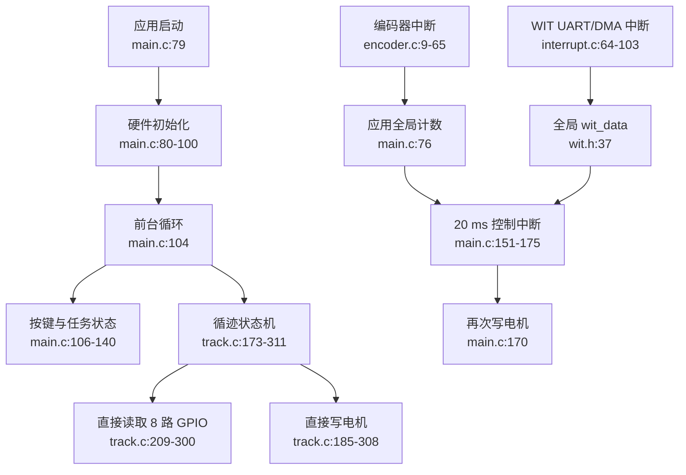

# 循迹小车功能边界

分析范围：`wit-oled-hardware-spi/` 中的应用与核心控制源码。`Debug/` 下的
SysConfig 生成文件只用于核对硬件接口；第三方显示器和传感器驱动不纳入本次重构。

## 已批准的五个系统

| 系统 | 当前入口 | 当前核心文件 | 目标职责 |
|---|---|---|---|
| App / Mission | `main.c:79`, `main.c:104` | `main.c`, `main.h`, `Drivers/GRAY/key.c` | 拥有启动、模式、目标圈数和 UI 状态；不直接控制硬件运动 |
| LineFollower | `Drivers/GRAY/track.c:173` | `track.c`, `track.h` | 输入循迹传感快照与时间，输出运动意图和圈数事件 |
| MotionControl | `main.c:151` | `main.c:151-175`, `Drivers/PID/pid.c`, `Drivers/MOTOR/motor.c` | 唯一拥有电机输出；固定周期把运动意图转换成左右轮输出 |
| Sensors | `encoder.c:9`, `interrupt.c:64`, `track.c:209` | `GRAY/gray.c`, `ENCODER/encoder.c`, `WIT/wit.c`, `MSPM0/interrupt.c` | 提供 line、encoder、yaw 的一致快照接口 |
| Platform / HAL | `main.c:80` | `wit-oled-hardware-spi.syscfg`, `MSPM0/clock.c`, `MSPM0/interrupt.c`, `MOTOR/motor.c` | 封装 SysConfig、GPIO、PWM、IRQ 和单调时间 |

## 当前关键控制流

## 主要所有权问题

- 电机存在两个写入者：`track.c:185-308` 与 `main.c:170`。
- `start` 同时由应用层 `main.c:138` 和循迹层 `track.c:309` 修改。
- `round_number` 由 UI 写入、循迹策略直接读取，没有显式配置接口。
- 编码器驱动写入定义在 `main.c:76` 的全局计数，驱动反向依赖应用。
- WIT ISR 异步更新 `wit_data`，控制器没有原子快照、有效性和时间戳。
- PID 算法模块定义 `LEFT/RIGHT/ANGLE` 业务实例，并通过地址特判 ANGLE。
- `main.h` 聚合几乎全部驱动，并与 `track.h` 形成循环包含。
- 循迹转弯使用前台调用次数计时，实际时间受 UI、蜂鸣和中断负载影响。

## 解耦硬约束

1. 只有 MotionControl 可以请求 Motor HAL 写 GPIO/PWM。
2. 中断只采样或发布 tick，不运行循迹策略、不直接决定电机命令。
3. LineFollower 是纯状态机：`snapshot + now + context -> intent + events`。
4. Sensors 拥有自己的 ISR 数据，只通过快照接口向上提供副本。
5. App / Mission 通过显式命令启动或停止，不允许子模块修改应用全局变量。
