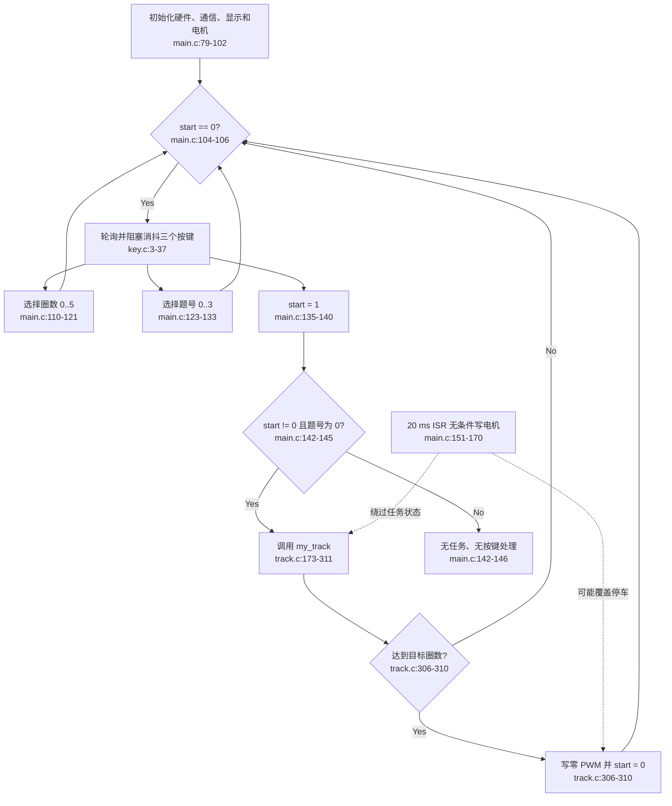

# App / Mission 当前流程

## Happy path

## 边界问题

- `main.c:79-147` 同时负责初始化、UI、任务选择和调度。
- `track.c:306-310` 反向修改 App 拥有的 `start`。
- `round_number` 默认值为 0；首次运行可以立即满足结束条件。
- 视觉题被选中后没有实际任务分支，主循环进入空转状态。
- TIMER0 控制路径完全绕过 Mission 状态。

## 外部依赖

- 输入：按键 GPIO、循迹状态、编码器、WIT yaw。
- 输出：LCD、蜂鸣器、LED、电机 PWM。
- 共享状态：`start`、`round_number`、`quetion_num`、三个 PID 单例。
