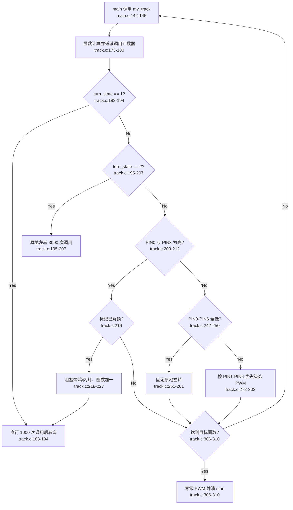

# LineFollower 当前流程

## 边界问题

- 一个函数同时承担 GPIO 采样、状态机、速度决策、反馈输出和任务结束。
- 状态为十个非 `static` 文件级全局量，缺少 `init/reset/start/stop`。
- 所有时间均以调用次数表达，且会被阻塞式蜂鸣、闪灯改变。
- PIN7 未参与丢线判断；部分传感器组合不会产生新命令，会保持旧 PWM。
- 丢线条件的两个分支行为完全相同，属于无效分支。
- 直接依赖 `main.h`、应用全局量、SysConfig GPIO 宏与 Motor HAL。

## 外部依赖

- `DL_GPIO_readPins()` 与 `track_PIN_n_*`。
- `motor_pwm_set()`、`beep()`、`flash()`。
- `start`、`round_number` 和主循环调用频率。
