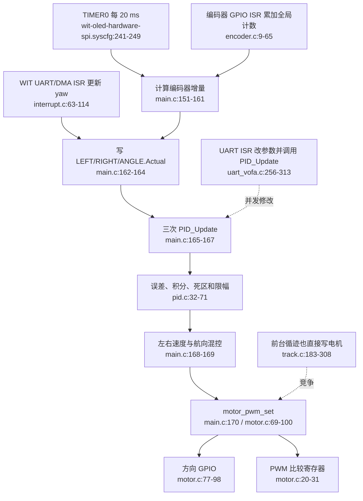

# MotionControl 当前流程

## 边界问题

- 没有 MotionControl 的单一入口；ISR 同时负责采样、控制、混控和输出。
- 前台循迹与 20 ms ISR 是两个并发电机写入者。
- TIMER0 与 `start`、任务模式无关，上电即拥有 PWM 写权限。
- 编码器 A/B、LEFT/RIGHT 与第二电机取反的映射分散在三个文件。
- ANGLE 误差未处理 ±180° 环绕；PID 无积分抗饱和。
- UART ISR 与 TIMER ISR 并发修改同一 PID 对象。
- PID 算法层通过 `p == &ANGLE` 特判业务实例。

## 外部依赖

- 编码器累计全局量与 WIT 全局 `wit_data`。
- UART 调参协议。
- TIMA1 调度、TIMA0 PWM、方向 GPIO 和 STBY。
- 前台 LineFollower 的直接电机输出。
