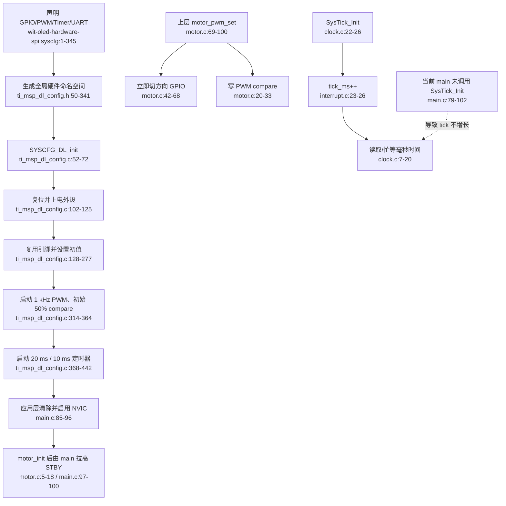

# Platform / HAL 当前流程

## 边界问题

- `SYSCFG_DL_init()` 同时配置、启动 PWM 和定时器，安全启动顺序依赖隐含 GPIO 初值。
- 生成头把寄存器实例、引脚和 IRQ 全部泄漏给业务模块。
- `motor.h` 暴露方向、单通道 PWM 和 GPIO 宏，无法保证命令一致提交。
- Timer、Encoder 和 UART 的 ISR 所有权分散在 `main.c`、`encoder.c` 和 `interrupt.c`。
- `interrupt.c` 理解多个传感器协议，平台层反向依赖设备层。
- SysTick API 已被多驱动依赖，但启动路径没有初始化它。

## 外部依赖

- TI MSPM0 SDK、SysConfig、DriverLib 和 CMSIS。
- App 对 NVIC、STBY 的直接操作。
- MotionControl、LineFollower 对 Motor HAL 的并发调用。
- Encoder/WIT/BNO 等模块提供的全局缓冲和数据结构。
