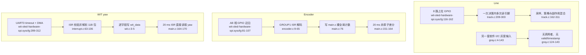

# Sensors 当前流程

## 边界问题

- Line 没有“一帧快照”；同次策略判断可能混用不同时刻的引脚值。
- 软件 I2C 灰度路径与并行 GPIO 路径重复，当前未接入且缺少 ACK/超时处理。
- 编码器驱动反向写入 `main.c` 拥有的计数，差分读取不是原子操作。
- WIT ISR 同时负责 DMA、组帧、解析和发布，数据没有 valid、timestamp 或 sequence。
- 三类输入都把“未更新/断线”静默解释为正常旧值或零值。

## 外部依赖

- SysConfig/DriverLib GPIO、DMA、UART、Timer、SysTick。
- App 全局状态、PID 单例和 Motor HAL。
- 当前未初始化的 SysTick 时间基准。
