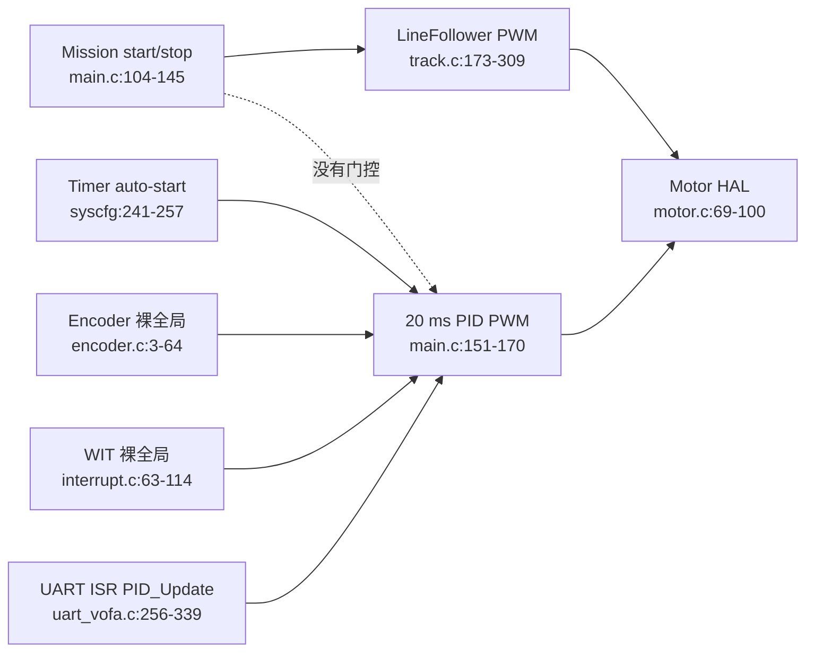

# 重复职责与所有权冲突

## 需要统一的跨系统 concern

### 1. 电机有两个最终写入者（最高风险）

- LineFollower：`Drivers/GRAY/track.c:183-206,242-309`
- TIMER0 MotionControl：`main.c:151-170`
- 共同落到：`Drivers/MOTOR/motor.c:69-100`

这不是合理的双模式，而是后加入 PID 后留下的两条完整执行链。循迹可以决定运动
意图，只有 MotionControl 能把意图转换为轮端命令。

### 2. 启停生命周期由三个系统共同管理

- App 设置 `start`：`main.c:63-66,104-145`
- LineFollower 清除 `start`：`track.c:306-309`
- SysConfig 上电自动启动 TIMER0/TIMER1：`wit-oled-hardware-spi.syscfg:241-257`
- App 与 Motor 分别管理 NVIC、方向脚和 STBY：`main.c:85-100`、`motor.c:5-18`

`start == 0` 当前不等于“执行器已禁能”。Mission 应拥有任务状态，
MotionControl 应拥有 armed/disarmed，Motor HAL 应拥有 STBY/PWM 安全状态。

### 3. 四种时间语义互不等价

- LineFollower 用调用次数：`track.c:177-203,216-227`
- 控制环用 20 ms timer：`main.c:151-170`
- Platform 提供未初始化的 SysTick：`clock.c:4-26`、`main.c:79-102`
- 按键/反馈使用 cycle 忙等：`key.c:3-37`、`beeper.c:3-8`、`led.c:4-8`

硬件 timer 与单调毫秒时间可以共存，但所有状态机 deadline 必须基于同一 `now_ms`；
主循环调用频率不能充当时间。

### 4. 三类传感器都用裸共享状态发布

- Line：同一决策多次直读 GPIO，`track.c:209-303`
- Encoder：ISR 写 App 全局计数，`encoder.c:3,9-64`、`main.c:76`
- WIT：ISR 逐字段写全局结构，`interrupt.c:63-114`、`wit.c:3-5`

GPIO、正交编码器与 UART 协议是合理特化；`valid + timestamp + snapshot` 应成为一致的
上层契约，不需要做通用传感器工厂。

### 5. 左右轮与符号补偿分散在四层

- 编码器 A/B 交叉写计数：`encoder.c:16-61`
- LEFT/RIGHT 与电机参数交叉：`main.c:157-169`
- Motor 固定反转第二路：`motor.c:69-72`
- LineFollower 硬编码左右轮正负：`track.c:183-303`

物理极性差异合理，但必须只在 Encoder HAL 与 Motor HAL 各归一化一次。上层统一使用
“左/右、前进为正”。

### 6. PID 状态有两个执行入口

- TIMER0 周期执行：`main.c:162-170`
- UART ISR 改参数后立即执行：`uart_vofa.c:256-339`
- 两者修改同一全局 PID：`pid.c:5-71`

UART 只提交待应用的参数；PID 只在 MotionControl tick 中运行。

### 7. IRQ 生命周期分散

- SysConfig 自动启动 timer：`wit-oled-hardware-spi.syscfg:241-257`
- App 手工 clear/enable：`main.c:85-96`
- WIT 自己 enable UART IRQ：`wit.c:7-14`
- ISR 分散在 `main.c:151-187`、`encoder.c:9-64`、`interrupt.c:23-114`

设备 ISR 的协议处理可以特化；优先级、enable/disable 与开始运行的生命周期必须由
Platform/各设备驱动明确拥有。

## 同一功能内值得删除或合并的重复

- 三份按键阻塞消抖：`key.c:6-15,16-25,27-35`。
- 丢线条件真假两边行为完全相同：`track.c:254-261`。
- 同一轮决策三次读取相同 line GPIO：`track.c:209-211,243-249,273-300`。
- 六份“读 pin → 写 PWM → last_state”：`track.c:273-302`。
- 三代 `my_track()` 共存于注释和活动代码：`track.c:7-37,48-160,173-311`。
- 左右电机复制 signed-PWM 提交流程：`motor.c:20-31,42-68,77-98`。
- 12 个串口 PID 调参分支：`uart_vofa.c:266-313`。
- 两套 UART 接收缓冲：`uart_vofa.c:324-352`。
- 两份 PID_Update 实现（一份被注释）：`pid.c:32-73,80-111`。
- 两套编码器解码骨架：`encoder.c:17-38,41-61`。
- WIT DMA arm/re-arm 分散：`wit.c:9-12`、`interrupt.c:111-113`。
- 未使用的软件 I2C 灰度路径与活动 GPIO 路径并存：
  `gray.c:38-143`、`track.c:209-303`。
- TIMER1 已启动但处理体为空：`wit-oled-hardware-spi.syscfg:251-257`、
  `main.c:177-187`。

## 不应为了去重而合并

- BNO08X 与 WIT parser 的帧格式不同：
  `interrupt.c:28-60`、`interrupt.c:63-114`。
- LineFollower 的前进态与转弯态行为不同：
  `track.c:183-194`、`track.c:195-207`。
- PID 输出限幅和 Motor 最终硬限幅保护不同层级：
  `pid.c:69-71`、`motor.c:34-40`。
- GPIO、Encoder、UART 的采集机制不同；只统一快照契约。

## 冲突关系

