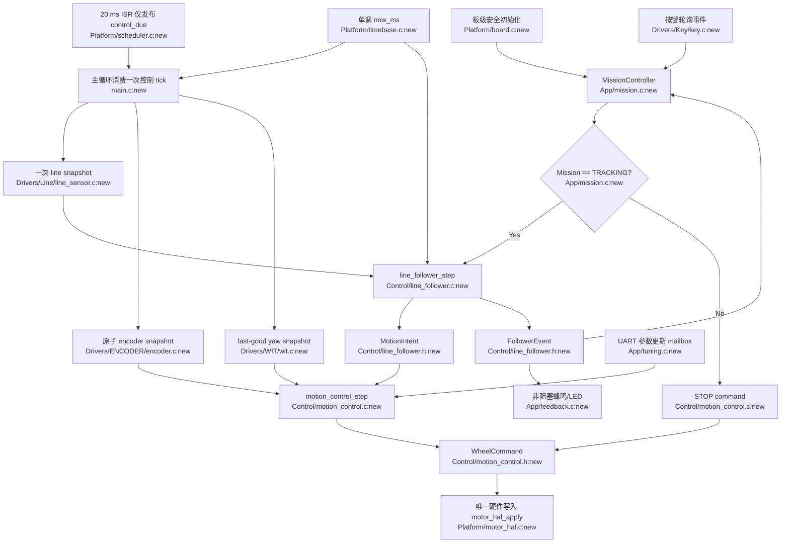

# 最小统一架构提案

目标不是增加“框架层”，而是让状态和副作用各有一个所有者。

## 1. MissionController

单一入口：

```c
MissionOutput mission_step(Mission *mission,
                           KeyEvent key,
                           FollowerEvent follower_event);
```

目标位置：`App/mission.c:new`。

职责：

- 唯一拥有 `IDLE/TRACKING/STOPPING/FAULT`、目标圈数和当前任务。
- 输入按键事件和 LineFollower 完成/故障事件。
- 输出 `run_line_follower`、`target_laps`、反馈事件。
- 不碰 PWM、GPIO、PID 或传感器全局量。

旧调用点变化：

- `main.c:104-145` 的 `start/round_number/quetion_num` 分支改为调用 `mission_step()`。
- `track.c:306-309` 不再清 `start`，只返回 `FOLLOWER_COMPLETE`。
- 当前没有消费者的视觉题选择 `main.c:123-133` 暂时删除；等视觉任务存在时再加一个明确状态。

## 2. LineFollower

单一入口：

```c
FollowerOutput line_follower_step(LineFollower *ctx,
                                  LineSample line,
                                  uint32_t now_ms);
```

目标位置：`Control/line_follower.c:new`。

输入/输出：

- 输入是一帧已经归一化的 8-bit line mask、`valid` 和 `now_ms`。
- 输出 `MotionIntent { forward, steering, enabled }` 与
  `FOLLOWER_RUNNING/COMPLETE/LINE_LOST`。

旧调用点变化：

- `track.c:209-303` 的 GPIO 读取全部改为一次 `line_sensor_sample()`。
- `track.c:183-303` 的所有 `motor_pwm_set()` 改为填写 `MotionIntent`。
- `track.c:218-219` 的蜂鸣/闪灯改为返回事件，由 App/Feedback 消费。
- `track.c:177-203` 的调用次数改为 `now_ms` deadline。
- 状态收进 `LineFollower`，由 `line_follower_reset()` 显式复位。
- 删除 `track.c:7-160` 的两代注释实现、无效丢线分支和未使用的 PIN 优先级骨架。

## 3. Sensor snapshots

三个小接口，不建立通用传感器注册表：

```c
LineSample    line_sensor_sample(uint32_t now_ms);
EncoderSample encoder_take_sample(uint32_t now_ms);
YawSample     wit_get_sample(uint32_t now_ms);
```

目标位置：

- `Drivers/Line/line_sensor.c:new`
- `Drivers/ENCODER/encoder.c:new`
- `Drivers/WIT/wit.c:new`

统一契约是 `value + valid + timestamp`；采集机制仍各自特化。

旧调用点变化：

- `track.c:209-303` 不再看到 SysConfig 引脚宏。
- `encoder.c:3,9-64` 的计数改由 Encoder 模块私有持有；`main.c:151-164`
  改为一次临界区快照。
- `interrupt.c:63-114` 的 WIT DMA/解析移回 WIT 驱动，发布 last-good snapshot。
- 删除当前零调用者的软件 I2C 灰度路径 `gray.c:38-143`。这会失去对未知第二种灰度模块的
  潜在支持；在没有硬件 SKU 证据时，这个损失可接受。

## 4. MotionControl 与 Motor HAL

MotionControl 单一入口：

```c
WheelCommand motion_control_step(MotionControl *ctx,
                                 MotionIntent intent,
                                 EncoderSample encoder,
                                 YawSample yaw,
                                 float dt_s);
```

Motor HAL 单一写入口：

```c
void motor_hal_apply(WheelCommand command);
```

目标位置：

- `Control/motion_control.c:new`
- `Platform/motor_hal.c:new`

规则：

- 只有 `motor_hal_apply()` 能写 AIN/BIN、PWM 和 STBY。
- TIMER0 ISR 只发布 `control_due`，不读传感器、不跑 PID、不写电机。
- `main` 在固定 20 ms tick 中取得三个 snapshot，依次调用
  LineFollower、MotionControl、Motor HAL。
- Mission 非 TRACKING、关键 sample 无效或命令 disabled 时，统一提交 STOP。
- LEFT/RIGHT 与前进正方向在 Encoder HAL 和 Motor HAL 各归一化一次，上层不再交叉补偿。

旧调用点变化：

- `track.c:183-308` 的全部电机调用删除。
- `main.c:151-170` 的 ISR 控制逻辑移入 `motion_control_step()`；ISR 只置位。
- `main.c:97-100` 的方向脚/STBY 操作移入 `motor_hal_init()`。
- `motor.h:15-21` 不再公开单轮速度、方向与限幅函数。
- `motor.c:69-98` 内部用一个私有 signed-channel helper 统一左右提交流程。

## 5. PID 与调参

单一算法入口：

```c
float pid_step(Pid *pid, float setpoint, float measurement, float dt_s);
```

目标位置：`Control/pid.c:new`。

变化：

- `pid.c:5-26` 的 `LEFT/RIGHT/ANGLE` 全局单例变为 `MotionControl` 私有成员。
- 删除 `pid.c:39-48` 的 `p == &ANGLE` 地址特判；角度环绕在调用前显式归一化。
- 增加与输出限幅一致的 anti-windup。
- UART 只解析并提交 `PidConfigUpdate`；不在 ISR 中调用 `PID_Update()`。
- `uart_vofa.c:266-313` 的 12 个分支收敛为一个明确 `switch`，参数在下一控制 tick 应用。
- Motor 最终 ±99 硬限幅继续保留，它与 PID 限幅不是重复。

## 6. Platform / scheduler

- `SysTick_Init()` 在板级初始化时明确调用，提供唯一 `now_ms`。
- 保留 TIMER0 作为 20 ms control tick；ISR 只增加一个有上限的 pending 计数。
- 删除无消费者的 TIMER1：`syscfg:251-257`、`main.c:177-187`。
- 按键与蜂鸣/LED 改为非阻塞 step；不在控制路径中调用 `delay_cycles()`。
- `main.h` 不再聚合所有驱动。每个 `.c` 只包含自己直接使用的最小头文件。

## 统一控制流



## 可接受的能力收缩

- 暂时删除无调用者的软件 I2C 灰度驱动。
- 暂时删除没有任务实现的视觉题选择。
- 删除空 TIMER1 和历史注释代码。
- 调参命令不再在 UART ISR 内立即跑 PID，而是在下一个 20 ms tick 生效。

这些收缩不影响当前可运行的并行八路循迹目标，并显著减少隐含路径。

## 建议迁移顺序

1. 先建立 Motor HAL 唯一写入口，TIMER0 ISR 改为只置位；架空轮验证 STOP。
2. 提取一次 line snapshot 与纯 `LineFollower`；用离线 bit mask 单测状态机。
3. 封装 Encoder/WIT snapshot，固定 20 ms 主循环控制 tick。
4. 引入 Mission 状态和非阻塞反馈，删除 `start/round_number` 跨层全局。
5. 收拢 PID 实例与 UART 调参，再删除 `main.h` 聚合依赖和死代码。
