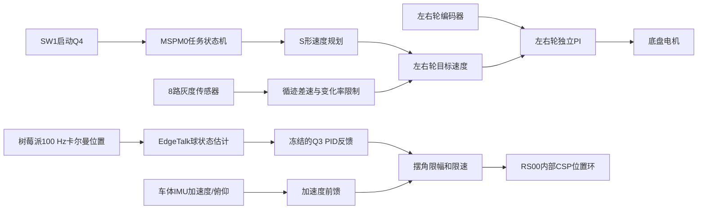

# Q4 车载滚球最小实施建议

日期：2026-07-31

适用仓库：`HalloYang06/2026_TI`，实施分支 `test/q4-ball-stability-isolated`

适用任务：小车从 A 点启动，沿黑线顺时针通过 B，时间不超过 8 s；钢球稳定在视觉零点 O 附近，最大位置误差绝对值不超过 10 mm。

## 1. 结论

Q4 不更换 Q3 已经实机验证的 PID，也不引入 LQR/LQI。第一版只增加两项：

1. MSPM0 对底盘执行平滑速度规划、左右轮速度 PI 和受限循迹差速，消除弹射启动和左右轮不一致。
2. EdgeTalk 在 Q3 PID 输出上叠加车体纵向加速度/俯仰前馈，抵消底盘加减速对钢球的扰动。

视觉端已经使用二维卡尔曼 `[像素位置, 像素/帧速度]`，不再串联 α-β 滤波。当前协议继续只发送滤波后位置；英飞凌继续使用现有观测器给 PID 提供球速。只有实测证明该速度明显抖动或滞后时，才考虑用 α-β **替换**英飞凌观测器，不能两者叠加。

### 1.1 当前实现状态

分支`test/q4-ball-stability-isolated`已经增加与任务和硬件解耦的纯C保持控制器：

```text
firmware/edgetalk/include/hball_hold_controller.h
firmware/edgetalk/src/hball_hold_controller.c
```

模块输入只有目标位置、估计位置/速度、纵向加速度、车体俯仰、周期和使能位；输出只有反馈摆角、前馈摆角和经过限幅/限速的最终摆角。模块不包含RT-Thread、CAN、RS00、四连杆或任务号，因此：

- Q4/Q5传入`target_position_m = 0`。
- Q6传入启动时锁存的任意`target_position_m`。
- RT-Thread适配层负责读取快照、四连杆换算、RS00 CSP发送和安全停机。
- MSPM0底盘保持关闭时，现有`hball_hold_center5`就是隔离稳定性测试入口。

当前保持模式默认启用全量纵向加速度前馈（增益1.0），并以视觉观测器的等效扰动状态做
0.5倍补偿；停机状态下仍可用命令从0到1逐级调节加速度前馈：

```text
hball_hold_ff_gain5 0
hball_hold_ff_gain5 250
hball_hold_ff_gain5 500
hball_hold_ff_gain5 750
hball_hold_ff_gain5 1000
```

保持控制目标固定为`x=0`时，控制周期按实际5 ms间隔运行，RS00 CSP目标最高以200 Hz
刷新。视觉位置经延迟观测器融合为位置/速度/等效扰动，IMU只负责底盘平面加速度和车体
俯仰前馈；两套反馈不会叠加成两个独立滚球控制器。当前WIT `0x51`发布的是含重力投影
的specific force，EdgeTalk先用俯仰把body-Y转换成车辆前向惯性加速度，再按摆杆轴做投影，
同时送入观测器和前馈，避免两处重复补偿。摆杆沿车体前进方向时，投影角`delta=0`，
所以X轴横向量不能直接加到Y轴；转弯向心量单独按`a_c=v*omega=v^2/R`计算，距转动中心
为`s`的摆杆点再使用沿杆的`omega^2*s`项。

`hball_q3_status5`在保持模式下额外显示IMU X/Y、沿杆加速度、`v*omega`向心估计、加速度零偏、滤波加速度、反馈/前馈/最终摆角和限幅标志。Q3仍走原有PID/LQI分支，不调用这个新模块。

### 1.2 估计器与控制器的取舍

首版采用“200 Hz三状态Kalman/OOSM + 200 Hz受限PD/I + IMU加速度前馈”的结构：

```text
x_hat = [球位置, 球速度, 未建模球加速度]
a_forward = (specific_force_y - g*sin(pitch)) / cos(pitch)
a_pipe_base = a_y*cos(delta) + a_x*sin(delta)
a_pipe = a_pipe_base - omega^2*s
theta_ff = atan2(a_pipe, g) - pitch
theta_cmd = theta_ff - Kp*(x_hat - target)
                    - Kd*v_hat - Ki*integral(x_hat - target)
```

Kalman是必要的：视觉约100 Hz且有曝光/传输延迟，不能直接差分位置做电机跟踪；当前
观测器已保留32个5 ms历史节点，可做延迟位置更新和重放。LADRC不放进第一版实时主环：
它的ESO若按视觉误差高带宽运行，容易把视觉延迟和测量噪声当成快速扰动，与Kalman的
`未建模加速度`重复估计。等静止、启停、转弯日志稳定后，再用同一日志离线比较LADRC的
扰动估计；只有它在延迟、饱和和噪声包线下明显优于Kalman，才考虑作为可替换估计器。

最终调参顺序固定为：先确认IMU坐标/符号、`v*omega`向心符号和静止零偏，再调`Kff_accel`，然后调`Kp/Kd`，
最后只加消除静态偏差所需的`Ki`。Q4/Q5目标传入0，Q6目标由任务层锁存；Q3的目标序列
仍由任务层管理，控制器不认识Q号。

当前无板验证结果：

- 纯C控制器使用Windows MinGW GCC的`-Wall -Wextra -Werror -pedantic`编译并通过测试。
- 使用RT-Thread Studio GCC 13.3按Cortex-M33目标参数编译通过。
- EdgeTalk与视觉主机回归`67 passed`。
- 既有滚球仿真回归`29 passed`。
- Q2的`track.c`以及树莓派视觉检测/协议文件哈希未变化。
- 当前电脑没有已同步的EdgeTalk集成SCons工程，因此完整M33链接、烧录和硬件运行留到板子接入后执行。

## 2. 已确认事实与假设

### 2.1 已确认

- 小车向前加速时，钢球向视觉负方向运动。
- 视觉负方向为钢球向合页轴心方向运动。
- 树莓派视觉程序请求 100 Hz，钢球位置已经经过二维卡尔曼。
- 当前视觉64字节测量帧只包含钢球位置，不包含视觉卡尔曼内部速度。
- Q3 使用纯 PID 已经能完成 `O -> +5 cm -> -5 cm`，其控制参数和执行逻辑必须冻结。
- Q2 只允许 MSPM0 单独循迹，不依赖 EdgeTalk、树莓派或跨主控通信。
- Q4 才同时启用 MSPM0 循迹和 EdgeTalk 滚球控制。
- MSPM0 的 `TIMER_0` 当前周期为20 ms，即底盘速度环可先按50 Hz实现，不需要先改 SysConfig。
- `track.c` 的有效黑线逻辑为 GPIO 低电平有效；不得再次改变极性。

### 2.2 实施时必须现场确认

- RS00电机目标角正方向对应钢球向视觉正方向还是负方向。
- MSPM0左右轮编码器与左右电机的对应关系、计数正负号。
- A到B实际距离、现有Q2通过A/B的标志识别条件和实测用时。
- IMU纵向轴的符号、静止零偏及俯仰角正方向。
- 树莓派实机正在运行的源码是否与仓库版本一致；2026-07-31检查时`192.168.3.33`不可达。

没有确认这些符号前，只允许架空车轮或断开底盘动力验证，不能根据数学公式直接开放地面运行。

## 3. 成功标准

Q4完成至少5次连续实测，并同时满足：

- 从SW1有效启动到通过B位置不超过8 s。
- 全程视觉位置有效，钢球位置最大绝对值不超过10 mm。
- 工程调参目标：正常段尽量保持在5 mm以内，给转弯、反光和通信抖动留余量。
- 启动无车轮瞬间满PWM、无明显弹射、无原地旋转。
- 左右轮速度闭环没有持续饱和或一快一慢。
- RS00无故障，视觉、IMU和电机反馈没有超时停机。
- Q2和Q3回归测试结果与修改前一致。

## 4. 控制架构与职责



职责边界：

| 节点 | Q4职责 | 不允许承担的职责 |
|---|---|---|
| MSPM0 | 任务选择、循迹、平滑速度规划、轮速PI、IMU/轮速上报 | 不计算钢球PID，不依赖树莓派才能循迹 |
| 树莓派 | 检测钢球、输出滤波后位置、录像、记录日志 | 不直接控制RS00或底盘 |
| EdgeTalk | 球状态估计、Q3 PID反馈、IMU前馈、连杆换算、RS00命令与安全保护 | 不接管底盘循迹 |
| RS00 | 内部CSP位置环和FOC | 不承担视觉位置外环 |

## 5. 视觉处理建议

### 5.1 保留当前算法

当前视觉链路为：透视矫正、轮廓/霍夫/连通域检测、模板匹配、二维卡尔曼、非线性像素标定。已有静态测试位置标准差约0.257 mm、P95约0.568 mm，测量精度足够支撑Q4。

第一版保持以下行为：

- 只发送实际检测并通过创新门限的球位置。
- 预测帧不冒充有效测量发送。
- 位置单位继续使用米进入EdgeTalk。
- 不修改64字节视觉协议。
- 不在视觉卡尔曼之后再加α-β或低通滤波。

### 5.2 当前局限

- 卡尔曼状态转移使用固定一帧步长，内部速度单位是像素/帧，不是m/s。
- `confidence`找到球时固定为0.85，暂时不能准确反映模板/轮廓质量。
- `capture_time_us`是OpenCV帧出队时刻，不是曝光中点，摄像头缓存延迟仍未量化。

这些问题先记录日志评估，不在Q4第一版同时修改，避免视觉协议和控制器一起变化。

## 6. MSPM0底盘算法

### 6.1 保护Q2

Q2继续走已经确认的独立循迹路径，并保持`speed_pid_enabled = DISABLED`。Q4新增独立控制上下文，不重写`track.c`，不修改Q2的传感器极性、转弯时序和电机方向。

建议新增：

```text
firmware/mspm0/wit-oled-hardware-spi/App/Mission/q4_chassis_control.h
firmware/mspm0/wit-oled-hardware-spi/App/Mission/q4_chassis_control.c
```

`main.c`只负责Q4的初始化、20 ms周期调用、完成/故障退出和状态显示。不得让`track.c`和`TIMER_0`同时调用`motor_pwm_set()`。

### 6.2 Q4状态

```text
IDLE
  -> WAIT_BALL_READY
  -> SETTLE
  -> ACCELERATE
  -> CRUISE
  -> PASS_B
  -> DECELERATE
  -> COMPLETE

任意状态 -> FAULT_STOP
```

- `WAIT_BALL_READY`：等待视觉、RS00和EdgeTalk滚球控制就绪。
- `SETTLE`：底盘保持停止约200~300 ms，清零轮速PI、速度规划器和循迹历史。
- `ACCELERATE`：按S形曲线升速，禁止PWM阶跃。
- `CRUISE`：在满足8 s要求的速度下循迹。
- `PASS_B`：锁存通过B事件和用时。
- `DECELERATE`：平滑停车，不能直接把PWM清零造成钢球二次扰动。
- `FAULT_STOP`：先撤销加速，再在受控斜率内停车；RS00严重故障或急停除外。

### 6.3 S形速度规划

以20 ms为固定周期，内部先使用“编码器计数/周期”作为速度单位，减少首版标定工作：

```c
a_goal = clamp(kv * (v_target - v_ref), -a_brake_max, a_accel_max);
a_ref += clamp(a_goal - a_ref, -jerk_max * dt, jerk_max * dt);
v_ref += a_ref * dt;
```

约束：

- 初始升速时间先设为0.8~1.2 s。
- 加速和减速分别限幅，减速不能突然反向。
- `v_ref`不得越过最终目标速度。
- 调试时从满足循迹的最低速度开始，再依据A到B实测时间逐级增加。

### 6.4 循迹差速

Q4先复用Q2已验证的8路低电平有效传感器判定，将其结果转换成差速目标，不直接转换成左右PWM：

```text
v_left_target  = v_ref - delta_v
v_right_target = v_ref + delta_v
```

要求：

- `delta_v`做幅值限制，初始不超过`v_ref`的40%~50%。
- `delta_v`做变化率限制，禁止一帧从左最大修正跳到右最大修正。
- 丢线时沿最近一次转向方向低速搜索，不能原地满差速旋转。
- 通过B的识别继续采用稳定Q2的真实时间/标志判据，不能使用无固定周期的循环次数。

首轮不要同时把循迹改成新PD。先保留已验证的传感器判定，仅把输出从PWM改为轮速目标。

### 6.5 左右轮速度PI

每个车轮独立控制：

```text
e = v_target - v_measured
u = kff * v_target + kp * e + ki * integral(e)
```

要求：

- 不使用D项，编码器差分噪声没有必要再放大。
- 输出饱和时冻结或回算积分，任务开始、结束和故障时清零积分。
- 左右轮参数可不同，但必须先确认电机/编码器映射与符号。
- 输出最终统一经过电机方向映射；不得在控制公式中散布左右轮负号。
- `TIMER_0`只在Q4底盘控制激活时拥有`motor_pwm_set()`写权限。

调参顺序：先单轮架空调`kff`，再加`kp`，最后只加足够消除稳态误差的`ki`；然后双轮架空验证同目标速度下计数接近。

## 7. EdgeTalk滚球算法

### 7.1 冻结Q3反馈

Q4反馈部分直接复用Q3已经验证的PID参数：

```text
e = x_target - x_est
theta_fb = Kp * e + Ki * integral(e) - Kd * v_est
```

- Q4目标固定为视觉零点`x_target = 0`。
- Q3参数、Q3状态切换、Q3目标序列均不得修改。
- Q3和Q4分别保存/清零积分状态，任务切换时不能继承积分。
- 先关闭静摩擦补偿，除非实测重新证明需要。

### 7.2 加速度与俯仰前馈

简化滚球动力学为：

```text
x_ddot ~= k * (g * theta_world - a_pipe)
```

已知向前加速使球向视觉负方向运动，因此为了保持`x=0`，管体需要产生使球向视觉正方向的分量：

```text
theta_ff = Kff_accel * atan2(a_pipe_filtered, 9.80665) - Kff_pitch * body_pitch
theta_cmd = theta_fb + theta_ff
```

仓库当前Q4/Q5调试路径已经存在`atan2(a_forward, g) - pitch`形式，现场只需确认RS00和连杆映射后的实际方向，不应再新增第二套前馈。

实施要求：

- IMU静止时先估计纵向零偏。
- 沿摆杆加速度使用约5~8 Hz低通，禁止直接使用高频原始噪声。
- 第一轮`Kff_accel = 0`，确认纯Q3 PID配合平滑底盘是否已经满足要求。
- 再按`0.25 -> 0.5 -> 0.75 -> 1.0`逐级增加前馈比例。
- 每级至少跑3次，选择钢球峰值误差更小且不造成反向超调的值。
- 前馈只补偿已测得的加速度，不使用底盘期望PWM代替真实加速度。

### 7.3 输出约束

```text
theta_cmd
 -> 管体角度限幅
 -> 管体角速度限制
 -> 连杆逆解
 -> RS00目标角限幅/变化率限制
 -> CSP目标
```

Q4初始继续使用Q3安全摆角范围。若平滑底盘与前馈仍无法将误差控制在10 mm内，先降低底盘加速度，不要立即扩大摆角或提高PID增益。

## 8. 球位置驱动的底盘降速

这是保护逻辑，不是另一套滚球控制器：

| 钢球位置/状态 | MSPM0动作 |
|---|---|
| `|x| < 5 mm` | 按正常S形速度目标运行 |
| `5 mm <= |x| < 8 mm` | 禁止继续升速，保持或轻微降速 |
| `8 mm <= |x| < 10 mm` | 平滑降低底盘目标速度 |
| `|x| >= 10 mm`或视觉持续失效 | 记录本次失败并受控停车 |

降速目标也必须经过同一速度规划器，不能看到球偏移后瞬间清零PWM，否则减速度会再次把球甩向相反方向。

## 9. 日志与Simulink

Simulink只用于离线回放、比较参数和检查最坏工况，不进入比赛实时控制链。每次Q4至少记录：

- 统一任务号、`mission_epoch`和时间戳。
- 视觉原始位置、估计位置、估计速度、视觉有效位和龄期。
- IMU原始/滤波纵向加速度、俯仰角。
- `theta_fb`、`theta_ff`、最终管体目标角。
- RS00目标角、实际角、速度、故障和饱和状态。
- 左右轮目标速度、实测速度、最终PWM。
- 灰度传感器位图、循迹差速、底盘状态和通过B事件。

日志优先以50~100 Hz记录数值，不记录图像到MCU。视频仍由树莓派独立录像。日志丢失不得阻塞控制任务。

## 10. 分阶段实施与验证

### 阶段A：只读验证

- 确认树莓派实际视觉代码哈希、帧率和`capture_time_us`递增。
- 手推小车向前/后，确认IMU纵向加速度符号。
- 手动推动钢球，确认视觉坐标和合页方向。

通过条件：所有符号与本文件一致，无执行器动作。

### 阶段B：底盘架空

- 仅Q4启用`TIMER_0`轮速PI。
- 验证S形升速/降速、左右轮编码器映射和抗积分饱和。
- 验证Q2仍不受`TIMER_0`速度环覆盖。

通过条件：左右轮同目标下速度接近，无阶跃PWM和控制权争抢。

### 阶段C：地面循迹，不放球

- 从低速开始运行Q4底盘。
- 调整巡航目标与差速限制，使A到B满足8 s并保留余量。
- 禁止修改Q2稳定路径来迁就Q4。

通过条件：至少5次通过B，无原地旋转、反向行驶或冲出黑线。

### 阶段D：放球，关闭前馈

- 使用Q3 PID保持零点。
- 底盘按已验证的平滑曲线运行。
- 记录钢球在启动、直线、转弯、通过B和停车阶段的最大偏差。

通过条件：确认主要误差来自哪个阶段，再决定是否需要前馈。

### 阶段E：逐级加入前馈

- 只改变`Kff_accel`，每级至少3次。
- 选择最大误差最小、无反向超调的系数。
- 最后如有必要，只小幅调整Q4的D项；Q3参数保持不变。

通过条件：连续5次满足Q4时间和10 mm误差要求。

### 阶段F：回归

- Q2独立循迹回归。
- Q3 `O -> +5 cm -> -5 cm`回归。
- Q4连续5次回归。
- 复位、任务切换、重复按键和故障恢复后再次回归。

## 11. 推荐代码改动边界

第一批实现只允许触碰：

```text
firmware/mspm0/wit-oled-hardware-spi/App/Mission/q4_chassis_control.[ch]  # 新增
firmware/mspm0/wit-oled-hardware-spi/main.c                               # Q4调度
firmware/edgetalk/rtthread/hball_bench_app.c                              # Q4前馈参数/日志，必要时
firmware/edgetalk/tests/                                                   # 对应主机测试
```

第一批禁止修改：

```text
firmware/mspm0/wit-oled-hardware-spi/Drivers/GRAY/track.c                 # Q2稳定路径
vision/raspberrypi/ball_camera/ball_vision_sender.cpp                     # 视觉基线
vision/raspberrypi/vision_measurement_protocol.py                          # 64字节协议
Q3 PID参数、目标序列和完成判据
```

若实现者发现必须修改禁止项，应先给出实测证据和最小差异，单独提交，不能与Q4底盘控制混在同一提交。

## 12. 提交拆分

每个小改动独立提交并在提交后完成对应验证：

1. `test(mspm0): lock Q2 and Q3 regression baselines`
2. `feat(mspm0): add isolated Q4 jerk-limited speed profile`
3. `feat(mspm0): add Q4 dual-wheel PI and limited steering`
4. `feat(edgetalk): enable calibrated Q4 acceleration feedforward`
5. `test(q4): add replay and mission regression coverage`

不得把状态机、循迹极性、电机方向、视觉协议和滚球参数一次性混在一个提交中。

## 13. 回退条件

出现以下任一情况立即关闭新功能并回退到最近验证提交：

- Q2出现显示、按键、循迹或电机行为变化。
- Q3静止滚球结果变差。
- `track.c`和`TIMER_0`同时写电机PWM。
- 前馈使向前加速时钢球负偏差进一步增大。
- 轮速PI持续饱和、积分无法释放或左右轮方向异常。
- 视觉有效率、位置噪声或链路龄期因修改明显恶化。

回退后只保留日志，不通过提高摆角、取消保护或大幅提高PID增益掩盖根因。
