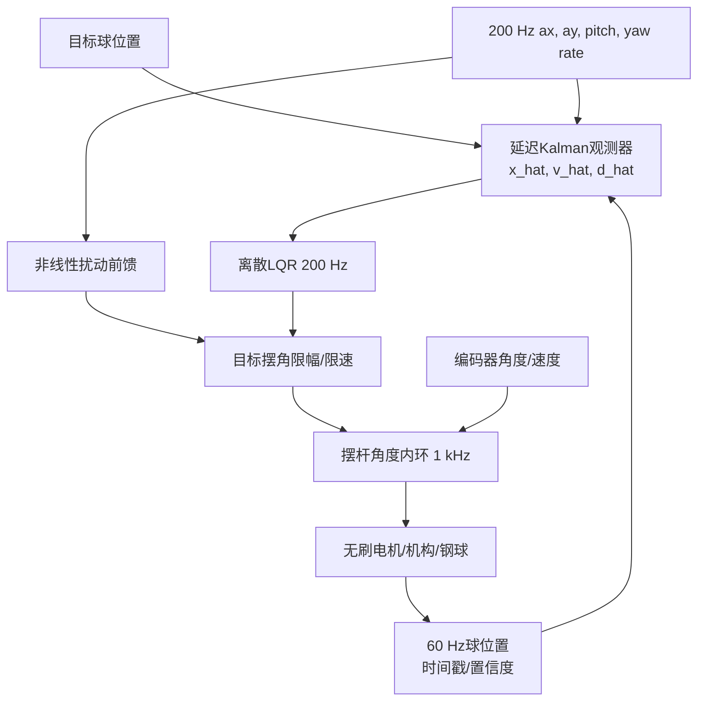

# H题三板系统架构

## 1. 设计原则

滚球控制和底盘控制分层。MSPM0 保证循迹和底盘的本地实时性；树莓派只输出有采集时刻的视觉测量；EdgeTalk 独占滚球状态估计与控制权。60 Hz 视觉更新不会阻塞 1 kHz 摆杆内环，板间通信中断也不会让旧数据被无限使用。

## 2. 闭环变量

正式控制使用以下四类反馈，并在 EdgeTalk 中按不同频率融合：

| 信息 | 进入的环节 | 作用 |
|---|---|---|
| IMU加速度、俯仰、偏航角速度 | 非线性预测与前馈 | 抵消加减速、坡度和转弯离心项 |
| 钢球位置与5帧拟合球速 | LQG外环 | 控制位置误差并处理视觉延迟/噪声 |
| 无刷编码器角度/速度 | 1 kHz摆杆内环 | 让LQG输出的目标摆角真实落地 |
| 电机故障、母线电压、q轴电流/限幅状态 | 执行器健康与抗饱和 | 识别堵转、限流和控制能力下降 |

轮速编码器建议作为第五类“底盘状态”加入：它不直接塞进滚球 LQR 状态，而是用于校验 IMU 纵向速度、估算实际转弯半径，并让前馈在轮胎打滑时降权。若底盘已有编码器，应保留左右轮速度和里程计，而不是只发送期望速度。

不建议为了闭环数量增加额外摄像头或激光测距。若预算允许，最有价值的补充顺序是：

1. 摆杆输出端绝对角度传感器，用于发现电机编码器到摆杆之间的回差或连杆松动。
2. 电机母线电压/电流采样，用于抗饱和和电池压降降级。
3. 左右轮编码器，用于速度、实际曲率和打滑估计。
4. 轨道端部硬件限位或球脱轨光电，仅作为保护，不参与正常位置控制。

## 3. 多速率任务表

| 周期任务 | 频率 | 最迟完成时间 | 所属板 |
|---|---:|---:|---|
| 红外阵列采样 | 1 kHz | 0.5 ms | MSPM0 |
| IMU DMA取样/解包 | 1 kHz | 0.5 ms | MSPM0 |
| 底盘速度/差速环 | 500 Hz | 1 ms | MSPM0 |
| IMU与底盘状态发布 | 200 Hz | 2 ms | MSPM0 |
| 图像采集与球心识别 | 60 Hz | 12 ms目标值 | 树莓派 |
| 非线性预测、视觉更新、LQG | 200 Hz | 2 ms | EdgeTalk |
| 摆杆角度/速度内环 | 1 kHz | 0.5 ms | EdgeTalk |
| FOC电流环 | 20 kHz | 35 us目标值 | EdgeTalk或电机驱动器 |

这里的 20 kHz 只有在 EdgeTalk 直接承担三相 FOC 时成立。若5号电机内部驱动器已经闭合 FOC，EdgeTalk 只发送角度/速度/力矩目标并读取反馈，不重复实现电流环；最终以电机型号和协议确认结果为准。

## 4. 数据流与时间

- IMU 可使用 UART，推荐 `460800` 或 `921600 bit/s`、DMA、二进制定长帧、序号和 CRC。`115200` 在 200 Hz、约32字节状态帧时理论可用，但抗突发和调试余量不足，不作为正式值。
- MSPM0 到 EdgeTalk 首选独立 UART，避免把200 Hz状态流和电机控制帧挤在同一 CAN 总线上。若后续确认 EdgeTalk 有第二路 CAN 和独立收发器，再评估改用独立 CAN。
- 树莓派到 EdgeTalk 优先使用有线以太网 UDP；若接口受限，使用独立 USB-UART。两种传输都复用 `shared/protocol` 的消息语义。
- 每个数据包必须携带源端单调采集时间戳。EdgeTalk 根据握手估计时钟偏差，不能拿接收时刻冒充摄像头曝光时刻。
- EdgeTalk 保存至少100 ms状态历史，用采集时刻将延迟视觉更新投影到当前状态。

## 5. 控制结构

控制律、状态矩阵、参数和压力包络见 `experiments/h_ball_control_sim/LQR_MODEL.md`。

## 6. 故障与降级

| 事件 | EdgeTalk动作 | 底盘动作 |
|---|---|---|
| 单帧视觉离群 | 4σ门限拒绝，继续模型预测 | 不变 |
| 视觉空窗小于120 ms | 增大协方差，限制摆角变化率 | 限制继续加速 |
| 视觉超时超过验收阈值 | 目标摆角缓回安全值，标记失锁 | 降速并准备停车 |
| MSPM0状态短时丢包 | 短时保持并增大不确定度 | 本地循迹继续 |
| IMU/底盘状态持续超时 | 禁用运动前馈，滚球进入保护 | 有控制地停车 |
| 编码器/电机反馈超时或故障 | 禁止非零新目标，执行安全停机 | 立即停车 |
| 电池压降/电流限幅持续 | 抗饱和并降低可用摆角/带宽 | 降速 |

超时数值在台架测得 P95 与最坏延迟后再冻结，不能只按仿真假设写死。

## 7. 实物验证顺序

1. 称量钢球并测直径，确认是实心球；记录材料、表面状态和轨道接触材料。
2. 纯主机回放：用记录的视觉/IMU包驱动 EdgeTalk 算法，不连接电机动力。
3. 摆杆台架：车轮架空、底盘动力断开、限流电源、硬件急停可用、操作员能直接断电；分别做空载与带球小角度阶跃，辨识钢球反作用负载。
4. 缓慢增大摆角/加速度并用高速视频检查纯滚动假设，得到打滑阈值；正式限值保留安全裕量。
5. 静止滚球：完成 `0 -> +5 cm -> -5 cm`，确认误差和超调。
6. 架空底盘回放与低速直线。
7. 低速转弯、整圈、逐级压力验证。

自动化测试在任何阶段都不得解锁电机或发起车辆自主运动。
