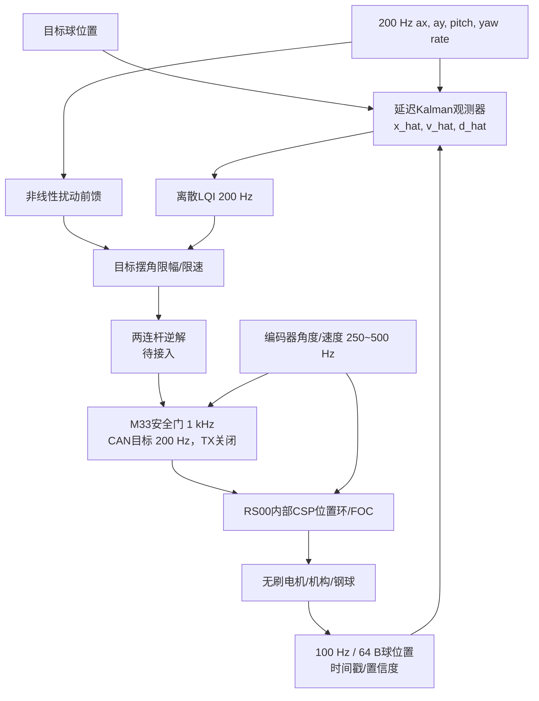

# H题三板系统架构

## 1. 设计原则

滚球控制和底盘控制分层。MSPM0保证循迹和底盘的本地实时性；当前树莓派只输出有采集时刻/处理龄期的100 Hz视觉测量，NanoPi-M5作为单机备选；EdgeTalk独占滚球状态估计、两连杆逆运动学和RS00安全控制权。视觉更新不会阻塞200 Hz shadow控制和1 kHz M33安全门，板间通信中断也不会让旧数据被无限使用。

## 2. 闭环变量

正式控制使用以下四类反馈，并在 EdgeTalk 中按不同频率融合：

| 信息 | 进入的环节 | 作用 |
|---|---|---|
| IMU加速度、俯仰、偏航角速度 | 非线性预测与前馈 | 抵消加减速、坡度和转弯离心项 |
| 钢球位置 | 延迟KF/OOSM与LQI外环 | 估计位置/速度/扰动并处理视觉延迟和噪声 |
| RS00角度/速度 | RS00内部位置环与M33安全监督 | 让控制目标经两连杆逆解后真实落地，并检测跟随误差 |
| RS00故障、温度、力矩/电流和限幅状态 | 执行器健康与抗饱和 | 识别超时、堵转、热降额和控制能力下降 |

轮速编码器建议作为第五类“底盘状态”加入：它不直接塞进滚球 LQR 状态，而是用于校验 IMU 纵向速度、估算实际转弯半径，并让前馈在轮胎打滑时降权。若底盘已有编码器，应保留左右轮速度和里程计，而不是只发送期望速度。

不建议为了闭环数量增加额外摄像头或激光测距。若预算允许，最有价值的补充顺序是：

1. 摆杆输出端绝对角度传感器，用于发现电机编码器到摆杆之间的回差或连杆松动。
2. 电机母线电压/电流采样，用于抗饱和和电池压降降级。
3. 左右轮编码器，用于速度、实际曲率和打滑估计。
4. 轨道端部硬件限位或球脱轨光电，仅作为保护，不参与正常位置控制。

## 3. 多速率任务表

| 周期任务 | 频率 | 最迟完成时间 | 所属板 |
|---|---:|---:|---|
| 红外阵列采样 | 1 kHz | 0.5 ms | MSPM0 |
| IMU DMA取样/解包 | 1 kHz | 0.5 ms | MSPM0 |
| 底盘速度/差速环 | 500 Hz | 1 ms | MSPM0 |
| IMU与底盘状态发布 | 200 Hz | 2 ms | MSPM0 |
| 图像采集与球心识别 | 100 Hz | 10 ms周期，单帧处理P95目标小于8 ms | 树莓派 |
| 当前非线性预测、视觉更新、LQG shadow | 200 Hz | 2 ms | EdgeTalk M55 |
| M33目标角安全监督 | 1 kHz | 0.5 ms | EdgeTalk M33 |
| 受限目标角CAN发布 | 200 Hz，当前禁用 | 2 ms | EdgeTalk M33 -> RS00 |
| RS00角度/速度反馈 | 250~500 Hz，待实测 | 2 ms | RS00 -> EdgeTalk M33 |
| 位置环与FOC电流环 | 驱动器内部频率，待厂家资料/实测 | 不由本项目假定 | RS00内部驱动器 |

首版执行器模式冻结为RS00的CSP位置模式：M55只输出水管目标角，部署前增加连续装配分支的两连杆逆解；M33完成正常`+-5 deg`、恢复约`+-7 deg`、硬限位`+-8 deg`、目标斜率、freshness和故障门，再以200 Hz写入受限`loc_ref`，同时设置保守的`limit_spd/limit_cur`。RS00内部闭合位置环和FOC，EdgeTalk不重复实现三相电流环。MIT位置-速度阻抗模式只作为CSP实测相位滞后无法满足包络时的备选；纯速度模式会累积角度漂移，纯力矩/电流模式对模型、摩擦和失联保护要求更高，均不作为首版。

## 4. 数据流与时间

- IMU 到 MSPM0 可使用 UART，推荐 `460800` 或 `921600 bit/s`、DMA、二进制定长帧、序号和 CRC。`115200` 在 200 Hz 状态流下余量不足，不作为正式值。
- MSPM0 与 RS00 共享 `1 Mbps Classic CAN` 接入 EdgeTalk M33。MSPM0五类只读遥测为720帧/s（心跳/加速度/角速度/轮速/姿态=`20/200/200/100/200 Hz`）；必须同时观察总线错误、FIFO溢出、重复/乱序/跳号/重启计数和各类数据age。重复或乱序帧不能刷新freshness，心跳未置`IMU_VALID`时新鲜IMU帧也不能进入控制有效位。
- 树莓派使用 USB Host 连接 EdgeTalk Device Type-C，发送固定64字节 `BALL_MEASUREMENT`。灰度ROI、二值图、轮廓点和完整图像留在树莓派本地，不进入控制链。
- 正式视觉为100 Hz；链路按240 Hz验收，500 Hz只做合成压力。主机写超时为20 ms，M33必须报告`usb_speed=2`，背压时跳过过期时隙而不是补发旧测量。
- 每个数据包必须携带源端单调采集时间戳。EdgeTalk 根据握手估计时钟偏差，不能拿接收时刻冒充摄像头曝光时刻。
- EdgeTalk 保存至少100到150 ms状态历史，用采集时刻对延迟视觉做历史更新并重放到当前状态。

## 5. 控制结构

旧LQG回归见`experiments/h_ball_control_sim/LQR_MODEL.md`；当前RS00两连杆、100 Hz视觉、
OOSM KF + LQI推荐基线和压力结果见`experiments/h_ball_control_simulink/`。

当前软件层次和运行时冻结见`docs/decisions/ADR-004-edgetalk-runtime-and-stream-boundaries.md`。M33运行RT-Thread并独占USB/CAN与安全门，M55使用Infineon官方FreeRTOS port运行200 Hz shadow算法；任何自动测试都保持`ACTUATOR_TX=0`。

## 6. 故障与降级

| 事件 | EdgeTalk动作 | 底盘动作 |
|---|---|---|
| 单帧视觉离群 | 4σ门限拒绝，继续模型预测 | 不变 |
| 视觉龄期小于100 ms | 继续模型预测，饱和时冻结积分 | 限制继续加速 |
| 视觉龄期100到250 ms | 增大协方差，水管收紧到`+-5 deg` | 降速并准备停车 |
| 视觉龄期大于250 ms | 进入留球/受控停车状态 | 有控制地停车 |
| MSPM0状态短时丢包 | 短时保持并增大不确定度 | 本地循迹继续 |
| IMU/底盘状态持续超时 | 禁用运动前馈，滚球进入保护 | 有控制地停车 |
| RS00反馈超过10 ms或故障 | 停止新运动需求，执行安全停机 | 立即停车 |
| 电池压降/电流限幅持续 | 抗饱和并降低可用摆角/带宽 | 降速 |

超时数值在台架测得 P95 与最坏延迟后再冻结，不能只按仿真假设写死。

## 7. 实物验证顺序

1. 称量钢球并测直径，确认是实心球；记录材料、表面状态和轨道接触材料。
2. 纯主机回放：用记录的视觉/IMU包驱动 EdgeTalk 算法，不连接电机动力。
3. 摆杆台架：车轮架空、底盘动力断开、限流电源、硬件急停可用、操作员能直接断电；分别做空载与带球小角度阶跃，辨识钢球反作用负载。
4. 缓慢增大摆角/加速度并用高速视频检查纯滚动假设，得到打滑阈值；正式限值保留安全裕量。
5. 静止滚球：完成 `0 -> +5 cm -> -5 cm`，确认误差和超调。
6. 架空底盘回放与低速直线。
7. 低速转弯、整圈、逐级压力验证。

自动化测试在任何阶段都不得解锁电机或发起车辆自主运动。
